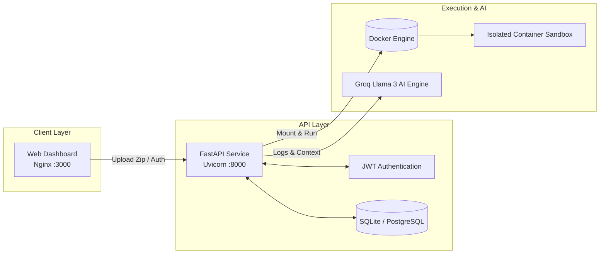

# 🛡️ Issue Prediction

> **Catch deployment errors before they reach production.**  
> An intelligent pre-deployment analyzer that executes your project code in isolated sandboxes and uses Groq AI to detect, explain, and recommend fixes for deployment issues.

---

## 🌟 Key Features

- 📦 **Automated Zip Analysis**: Upload project archives (`.zip`) for instant pre-flight validation.
- 🐳 **Isolated Container Sandbox**: Runs real build and dependency commands inside lightweight, restricted Docker containers.
- 🤖 **AI-Powered Diagnostics**: Integrated with **Groq AI** to translate complex build traces into human-readable root causes and actionable solutions.
- 🔍 **Cross-File Configuration Checking**: Detects mismatches across Dockerfiles, docker-compose configurations, and source files.
- 🔑 **Environment Variable Audit**: Scans code for environment variable references and checks against `.env` declarations.
- ⚡ **Multi-Ecosystem Support**: Validates Python (`pip`), Node.js (`npm`), Docker, and Docker Compose applications.

---

## 🏗️ Architecture



---

## 🚀 Quick Start

### 📋 Prerequisites

- **Docker & Docker Compose** (version 2.0+)
- **Groq API Key** (Free key available at [console.groq.com](https://console.groq.com))

---

### 📥 1. Clone & Set Up Environment

```bash
# Clone the repository
git clone https://github.com/dinu-vishruth/issue_prediction.git
cd issue_prediction

# Create environment configuration file
cp .env.example .env
```

Edit `.env` to configure your credentials:
```env
GROQ_API_KEY=your_groq_api_key_here
JWT_SECRET=your_super_secret_jwt_key
```

---

### 🐳 2. Run with Docker Compose

```bash
docker-compose up --build
```

Access the application services:
- 🌐 **Web Interface**: [http://localhost:3000](http://localhost:3000)
- 📚 **API Documentation (Swagger)**: [http://localhost:8000/docs](http://localhost:8000/docs)
- 🏥 **Health Check Endpoint**: [http://localhost:8000/health](http://localhost:8000/health)

To run in the background (detached mode):
```bash
docker-compose up -d --build
```

To stop all running services:
```bash
docker-compose down -v
```

---

## 🧪 Testing with the Sample Project

The repository includes a pre-configured sample project with intentional errors (`sample_project/`):

1. **Package the sample project**:
   ```bash
   cd sample_project
   zip -r ../sample_project.zip .
   cd ..
   ```

2. **Upload `sample_project.zip`** at [http://localhost:3000](http://localhost:3000).

### Detected Intentional Errors:
1. ❌ **Non-existent package** in `requirements.txt`
2. 🔑 **Missing environment variables** (`DB_PASSWORD`, `REDIS_URL`)
3. 🔌 **Port mismatch** between `Dockerfile` (8000) and `docker-compose.yml` (5000)
4. ⚠️ **Missing environment setting** (`POSTGRES_PASSWORD`) in `docker-compose.yml`

---

## 🛠️ Ecosystem Analysis Engine

| Project Type | Analyzed File | Verification Executed |
| :--- | :--- | :--- |
| **Python** | `requirements.txt` | `pip install --dry-run`, `pip check` |
| **Node.js** | `package.json` | `npm install --dry-run`, `npm ls` |
| **Docker** | `Dockerfile` | `docker build --no-cache` |
| **Docker Compose** | `docker-compose.yml` | `docker-compose config` |
| **Env Variables** | `.env`, `.py`, `.js` | Static AST / Regex scan for missing definitions |

---

## 🔒 Security & Sandbox Guarantees

All user-submitted code is isolated using strict Docker container constraints:

- 🧱 **Read-Only Mounts**: Source code is mounted read-only during execution.
- ⚡ **Resource Restrictions**: Hard limits enforced per analysis run (`512MB RAM`, `0.5 CPU cores`).
- 🌐 **Network Isolation**: Disables external internet access during command execution.
- ⏱️ **Execution Timeouts**: Prevents infinite loops or hung processes (30-second default limit).
- 🧹 **Automatic Cleanup**: Containers and temporary working directories are purged immediately post-analysis.

---

## 💻 Local Development Setup

### Backend (FastAPI)

```bash
cd backend
python3 -m venv venv
source venv/bin/activate
pip install -r requirements.txt
export GROQ_API_KEY="your_groq_api_key_here"
export JWT_SECRET="your_custom_secret"
uvicorn main:app --reload --host 0.0.0.0 --port 8000
```

### Sandbox Image (Required for local backend runs)
```bash
docker build -t deploycheck-sandbox -f Dockerfile.sandbox .
```

### Frontend (Static Web Server)
```bash
cd frontend
python3 -m http.server 3000
```

---

## 🛰️ API Reference

### `POST /upload`
Upload and analyze a project ZIP file.
- **Request**: `multipart/form-data` with `file` field (.zip format)
- **Response**: JSON payload containing detected files, raw output logs, detected issues, and AI recommendations.

### `GET /health`
Returns backend operational status and Docker daemon availability.
- **Response**: `{"status": "healthy", "docker_available": true}`

---

## 📄 License

Distributed under the MIT License. See `LICENSE` for more information.
