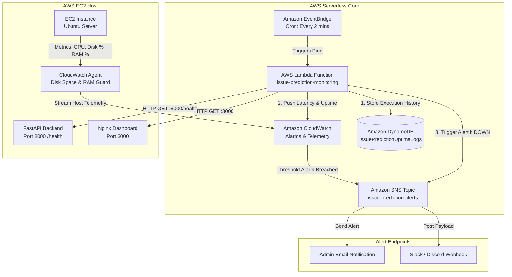

# 📊 AWS Serverless Monitoring & Alerting Guide: Issue Prediction System

> **Document Target**: Production Serverless Monitoring, Logging & Alerting Setup  
> **Project**: Issue Prediction System (FastAPI Backend + Nginx Frontend + Docker Sandbox)  
> **Version**: 1.0.0  

---

## 📑 Table of Contents

1. [System Architecture Overview](#-system-architecture-overview)
2. [Prerequisites & AWS Services Required](#-prerequisites--aws-services-required)
3. [Step 1: IAM Role & Security Permissions](#step-1-iam-role--security-permissions)
4. [Step 2: Amazon DynamoDB Setup (Uptime Logs)](#step-2-amazon-dynamodb-setup-uptime-logs)
5. [Step 3: Amazon SNS Setup (Instant Alert Dispatcher)](#step-3-amazon-sns-setup-instant-alert-dispatcher)
6. [Step 4: AWS Lambda Setup (Canary Monitoring Function)](#step-4-aws-lambda-setup-canary-monitoring-function)
7. [Step 5: Amazon EventBridge Setup (Automated Cron Trigger)](#step-5-amazon-eventbridge-setup-automated-cron-trigger)
8. [Step 6: CloudWatch Agent on EC2 Host (Disk & Memory Guard)](#step-6-cloudwatch-agent-on-ec2-host-disk--memory-guard)
9. [Step 7: Operational Playbook & Testing Verification](#step-7-operational-playbook--testing-verification)

---

## 🏗️ System Architecture Overview



---

## 📋 Prerequisites & AWS Services Required

| Service | Purpose | AWS Free Tier Allocation |
| :--- | :--- | :--- |
| **AWS IAM** | Secure identity and access management for Lambda | Included free |
| **AWS Lambda** | Serverless canary code pinging endpoints every 2 mins | 1,000,000 requests / month free |
| **Amazon EventBridge** | Automated cron scheduler triggering Lambda | 14,000,000 events / month free |
| **Amazon CloudWatch** | Aggregates metrics, logs, and triggers disk space alarms | 10 Alarms & 5 GB logs / month free |
| **Amazon SNS** | Dispatches instant alert emails to administrators | 1,000,000 notifications / month free |
| **Amazon DynamoDB** | Stores historical uptime records and latency logs | 25 GB NoSQL storage free |
| **CloudWatch Agent** | Monitors EC2 disk space to prevent Docker out-of-space crashes | Included free |

---

## Step 1: IAM Role & Security Permissions

The Lambda function requires execution permissions to publish custom metrics to CloudWatch, write execution records to DynamoDB, and publish alerts to SNS.

### 1.1 Create IAM Role
1. Log in to your **AWS Management Console** and navigate to **IAM**.
2. Select **Roles** from the sidebar $\rightarrow$ Click **Create role**.
3. Select **AWS service** as entity type $\rightarrow$ Under Use case, select **Lambda** $\rightarrow$ Click **Next**.

### 1.2 Attach IAM Managed Policies
Search for and attach the following policies:
- `AWSLambdaBasicExecutionRole` (Grants write access to CloudWatch Logs)
- `CloudWatchFullAccess` (Grants permission to push metrics & create alarms)
- `AmazonSNSFullAccess` (Grants permission to publish SNS alert emails)
- `AmazonDynamoDBFullAccess` (Grants permission to write items to DynamoDB)

4. Click **Next**.
5. Set **Role Name**: `IssuePredictionLambdaMonitoringRole`
6. Click **Create role**.

---

## Step 2: Amazon DynamoDB Setup (Uptime Logs)

DynamoDB stores every health check attempt to enable uptime reporting and historical latency tracking.

1. Open the **AWS Console** $\rightarrow$ Search for **DynamoDB**.
2. Click **Tables** in the sidebar $\rightarrow$ Click **Create table**.
3. Fill in the following table attributes:
   - **Table name**: `IssuePredictionUptimeLogs`
   - **Partition key**: `service_name` (Type: `String`)
   - **Sort key**: `timestamp` (Type: `String`)
4. Under **Table settings**, keep **Default settings**.
5. Click **Create table**.

---

## Step 3: Amazon SNS Setup (Instant Alert Dispatcher)

Amazon SNS dispatches immediate email or webhook notifications when any endpoint fails.

### 3.1 Create SNS Topic
1. Open the **AWS Console** $\rightarrow$ Search for **Simple Notification Service (SNS)**.
2. Select **Topics** $\rightarrow$ Click **Create topic**.
3. Select **Standard** type.
4. Set **Name**: `issue-prediction-alerts`
5. Click **Create topic**.
6. **Copy the Topic ARN** (e.g., `arn:aws:sns:us-east-1:123456789012:issue-prediction-alerts`).

### 3.2 Add Email Subscription
1. Inside the `issue-prediction-alerts` topic details page, click **Create subscription**.
2. Set **Protocol**: `Email`
3. Set **Endpoint**: Enter your administrator email address (e.g., `admin@example.com`).
4. Click **Create subscription**.
5. **Confirm Email**: Check your email inbox for an email from *AWS Notifications* and click **Confirm subscription**.

---

## Step 4: AWS Lambda Setup (Canary Monitoring Function)

### 4.1 Create Lambda Function
1. Open the **AWS Console** $\rightarrow$ Search for **Lambda**.
2. Click **Create function**.
3. Select **Author from scratch**:
   - **Function name**: `issue-prediction-monitoring`
   - **Runtime**: `Python 3.11`
   - **Architecture**: `x86_64`
4. Under **Permissions**, expand **Change default execution role**:
   - Select **Use an existing role**.
   - Choose `IssuePredictionLambdaMonitoringRole`.
5. Click **Create function**.

### 4.2 Lambda Source Code
Replace the default contents of `lambda_function.py` with the complete monitoring implementation below:

```python
import os
import time
import urllib.request
import json
from datetime import datetime, timezone
import boto3

# Initialize AWS SDK clients
cloudwatch = boto3.client('cloudwatch')
sns = boto3.client('sns')
dynamodb = boto3.resource('dynamodb')

# Configuration from Environment Variables
EC2_PUBLIC_IP = os.environ.get('EC2_PUBLIC_IP', 'YOUR_EC2_PUBLIC_IP')
SNS_TOPIC_ARN = os.environ.get('SNS_TOPIC_ARN')
DYNAMODB_TABLE_NAME = os.environ.get('DYNAMODB_TABLE', 'IssuePredictionUptimeLogs')

table = dynamodb.Table(DYNAMODB_TABLE_NAME)

ENDPOINTS = [
    {"name": "Backend_FastAPI", "url": f"http://{EC2_PUBLIC_IP}:8000/health", "expected_code": 200},
    {"name": "Frontend_Nginx", "url": f"http://{EC2_PUBLIC_IP}:3000", "expected_code": 200}
]

def lambda_handler(event, context):
    results = []
    has_failure = False
    iso_timestamp = datetime.now(timezone.utc).isoformat()

    for ep in ENDPOINTS:
        start_time = time.time()
        status_code = 0
        latency_ms = 0
        success = False

        try:
            req = urllib.request.Request(
                ep['url'],
                headers={'User-Agent': 'AWS-Serverless-Canary/1.0'}
            )
            with urllib.request.urlopen(req, timeout=5) as response:
                status_code = response.getcode()
                latency_ms = int((time.time() - start_time) * 1000)
                if status_code == ep['expected_code']:
                    success = True
        except Exception as err:
            latency_ms = int((time.time() - start_time) * 1000)
            print(f"Health check failed for {ep['name']}: {str(err)}")

        if not success:
            has_failure = True

        # 1. Write Log Item to DynamoDB
        try:
            table.put_item(
                Item={
                    'service_name': ep['name'],
                    'timestamp': iso_timestamp,
                    'status': 'UP' if success else 'DOWN',
                    'status_code': status_code,
                    'latency_ms': latency_ms,
                    'endpoint_url': ep['url']
                }
            )
        except Exception as db_err:
            print(f"DynamoDB write error: {db_err}")

        # 2. Publish Telemetry Metrics to CloudWatch
        try:
            cloudwatch.put_metric_data(
                Namespace='IssuePrediction/Monitoring',
                MetricData=[
                    {
                        'MetricName': 'ServiceUptime',
                        'Dimensions': [{'Name': 'ServiceName', 'Value': ep['name']}],
                        'Value': 1 if success else 0,
                        'Unit': 'Count'
                    },
                    {
                        'MetricName': 'ResponseLatencyMs',
                        'Dimensions': [{'Name': 'ServiceName', 'Value': ep['name']}],
                        'Value': latency_ms,
                        'Unit': 'Milliseconds'
                    }
                ]
            )
        except Exception as cw_err:
            print(f"CloudWatch metric publish error: {cw_err}")

        results.append({
            "service": ep['name'],
            "status": "UP" if success else "DOWN",
            "status_code": status_code,
            "latency_ms": latency_ms
        })

    # 3. Trigger SNS Email Alert if failure detected
    if has_failure and SNS_TOPIC_ARN:
        try:
            sns.publish(
                TopicArn=SNS_TOPIC_ARN,
                Subject="🚨 ALERT: Issue Prediction Service Failure Detected!",
                Message=(
                    f"AWS Serverless Canary detected service interruption on EC2 ({EC2_PUBLIC_IP}).\n\n"
                    f"Timestamp (UTC): {iso_timestamp}\n\n"
                    f"Check Results:\n{json.dumps(results, indent=2)}\n\n"
                    f"Recommended Action: Check EC2 container status via 'docker compose ps' or check system logs."
                )
            )
        except Exception as sns_err:
            print(f"SNS notification publish error: {sns_err}")

    return {
        "statusCode": 200 if not has_failure else 500,
        "body": json.dumps(results)
    }
```

6. Click **Deploy**.

### 4.3 Configure Lambda Environment Variables
1. Go to **Configuration** tab $\rightarrow$ Select **Environment variables** $\rightarrow$ Click **Edit**.
2. Add the following key-value pairs:

| Key | Value |
| :--- | :--- |
| `EC2_PUBLIC_IP` | `<YOUR_EC2_PUBLIC_IP>` |
| `SNS_TOPIC_ARN` | `arn:aws:sns:us-east-1:123456789012:issue-prediction-alerts` |
| `DYNAMODB_TABLE` | `IssuePredictionUptimeLogs` |

3. Click **Save**.

---

## Step 5: Amazon EventBridge Setup (Automated Cron Trigger)

EventBridge executes the Lambda health check automatically every 2 minutes.

1. Open the **AWS Console** $\rightarrow$ Search for **Amazon EventBridge**.
2. Select **Schedules** (or **Rules**) $\rightarrow$ Click **Create schedule**.
3. Configure Schedule:
   - **Schedule name**: `issue-prediction-canary-schedule`
   - **Schedule pattern**: Select **Recurring schedule**
   - **Schedule type**: Select **Rate-based schedule**
   - **Rate expression**: `2` `minutes`
4. Click **Next**.
5. Select Target:
   - **Target API**: Select **AWS Lambda**
   - **Lambda function**: Choose `issue-prediction-monitoring`
6. Click **Next** $\rightarrow$ Click **Create schedule**.

---

## Step 6: CloudWatch Agent on EC2 Host (Disk & Memory Guard)

To prevent Docker `no space left on device` crashes, configure the CloudWatch Agent on EC2 to stream disk usage metrics.

Execute the following commands on your EC2 terminal via SSH:

```bash
# 1. Install CloudWatch Agent package
sudo apt-get update && sudo apt-get install -y amazon-cloudwatch-agent

# 2. Create the CloudWatch agent configuration
cat << 'EOF' | sudo tee /opt/aws/amazon-cloudwatch-agent/etc/amazon-cloudwatch-agent.json
{
  "metrics": {
    "metrics_collected": {
      "disk": {
        "measurement": ["used_percent"],
        "metrics_collection_interval": 60,
        "resources": ["/"]
      },
      "mem": {
        "measurement": ["mem_used_percent"],
        "metrics_collection_interval": 60
      }
    }
  }
}
EOF

# 3. Start the CloudWatch Agent daemon
sudo /opt/aws/amazon-cloudwatch-agent/bin/amazon-cloudwatch-agent-ctl \
    -a fetch-config -m ec2 -s -c file:/opt/aws/amazon-cloudwatch-agent/etc/amazon-cloudwatch-agent.json
```

---

## Step 7: Operational Playbook & Testing Verification

### 7.1 Verify Lambda Canary Execution
1. Open the **AWS Lambda Console** $\rightarrow$ Select `issue-prediction-monitoring`.
2. Click the **Test** tab $\rightarrow$ Click **Test**.
3. Verify response status: `200 OK` with JSON telemetry output.

### 7.2 Verify DynamoDB Log Items
1. Open the **DynamoDB Console** $\rightarrow$ Select **Tables** $\rightarrow$ `IssuePredictionUptimeLogs`.
2. Click **Explore table items**. You should see periodic log entries recorded every 2 minutes.

### 7.3 Simulate Outage & Test Email Alerts
To verify end-to-end alerting:
1. Connect to EC2 and stop the backend container:
   ```bash
   docker compose stop backend
   ```
2. Wait up to 2 minutes.
3. Verify that an alert email titled `🚨 ALERT: Issue Prediction Service Failure Detected!` arrives in your inbox.
4. Restart backend container:
   ```bash
   docker compose start backend
   ```
